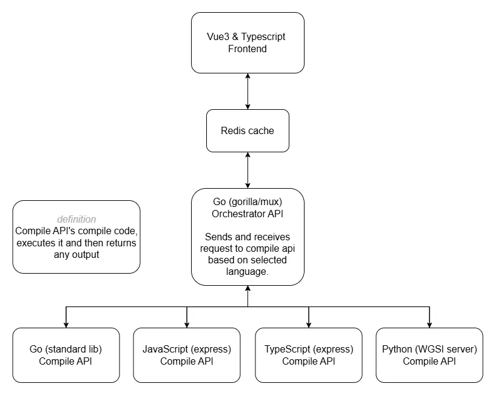

# jcompiler
#### Code Execution Service

A microservice-based system designed to execute code snippets in various programming languages.

## Running the Service

### Prerequisites

- Docker and Docker Compose
- Node/npm

### Installation

1. Install npm packages and build website:
   ```
   cd web
   npm install
   npm run build
   ```

### Deployment

1. Build and start the services using Docker Compose:
   ```
   docker-compose up --build --watch --remove-orphans
   ```

2. The vue website will be available at `http://localhost`

3. The orchestrator service will be available at `http://localhost/api/process`

## Overview

The Code Execution Service consists of an orchestrator and multiple language-specific runners that allow users to execute code in various programming languages:

- Go
- JavaScript
- TypeScript
- Python

The service is built to be reliable, scalable, and efficient by implementing caching to avoid redundant code executions.

## Architecture

The system uses a microservices architecture with the following components:
1. **Nginx Web Server**: Entry points `/` and `/api/process`

2. **Vue Website**: Frontend entry point `/`

3. **Orchestrator Service**: Backend entry point `/api/process` that receives code execution requests, validates them, checks the cache, and forwards requests to the appropriate runner.

4. **Language-Specific Runners**:
    - Go Runner (`golang-runner:8001`)
    - JavaScript Runner (`JavaScript-runner:8002`)
    - TypeScript Runner (`typescript-runner:8003`)
    - Python Runner (`python-runner:8004`)

5. **Redis Cache**: Stores execution results to avoid redundant processing of identical code.



## API Endpoints

### Orchestrator Service

#### POST `/api/process`

Processes a code execution request.

**Request Body**:
```json
{
  "code": "console.log('Hello, World!');",
  "timeout": 10,
  "language": "js",
  "args": ["arg1", "arg2"],
  "env": {
    "ENV_VAR1": "value1",
    "ENV_VAR2": "value2"
  }
}
```

**Parameters**:
- `code` (string, required): The code to execute
- `timeout` (integer, optional): Execution timeout in seconds (defaults to 10s or value in RUNNER_TIMEOUT env var)
- `language` (string, required): Programming language ("go", "js", "ts", "python")
- `args` (array, optional): Command-line arguments to pass to the program
- `env` (object, optional): Environment variables for the execution environment

**Response**:
```json
{
  "stdout": "Hello, World!",
  "stderr": "",
  "exitCode": 0,
  "executionTime": 35,
  "error": ""
}
```

#### GET `/health`

Health check endpoint.

**Response**: "OK" with status 200 if the service is running properly.

## Configuration

The service can be configured using environment variables:

- `MAX_REQUEST_SIZE`: Maximum size of request body in bytes (default: 102400, or 100KB)
- `RUNNER_TIMEOUT`: Default timeout for code execution in seconds (default: 10)

## Caching Behavior

The service caches execution results with the following behavior:

- Cache key: A string representation of the entire JSON request
- Cache duration: 1 hour
- Cache storage: Redis database

## Development Notes

- The orchestrator service uses the gorilla/mux router for HTTP routing
- Redis is used as a caching layer to improve performance
- All services use structured logging for better observability


## Todo

- Add authentication to api requests